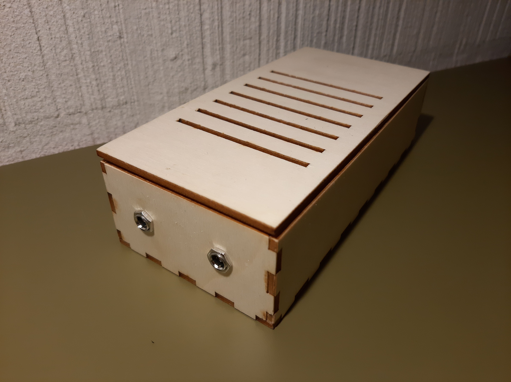

# Power Supply Case

This is a small project for a lasercut enclosure for [this 12V/60W switching PSU from Aliexpress](https://aliexpress.com/item/1005002728038351.html) which is also available from many other vendors. The whole thing is done in [FreeCAD](https://www.freecadweb.org/) so anyone can take a look.

  
  
  

## Background

The idea was originally to 3D-print the case, but I recently gained access to a lasercutter, so I decided to go down that route. The `case_simple` variant is just the walls of the 3D enclosure with the corresponding holes whereas the `*_cut` variant has tabs added with the `LCInterlocking` workbench. The `*.svg` files are then used for cutting.

Parts used:

* [12V/60W switching PSU](https://aliexpress.com/item/1005002728038351.html)
* [IEC320 AC-17 Power Plug](https://aliexpress.com/item/4000469723664.html)
* [DC Jack 5.5mm/2.1mm](https://aliexpress.com/item/32997585647.html)

## Features

Instead of measuring and parameterizing the model myself I decided to look for the models on [grabcad.com](GrabCAD) and base all cuts on them. I used the following models in the design process which can also be found in the `3d_models` folder:

* [S-60-12](https://grabcad.com/library/s-60-12-1) PSU Model by Aleksander Ugnenko
* [IEC320_AC-14](https://grabcad.com/library/iec320-c14-1) Power Connector Model by Richard Bruning (currently not used)
* [IEC320_AC-17](https://grabcad.com/library/ac-power-socket-3-pin-250v-10a-ac-17-iec3-c14-1) Power Connector Model by Igor Vladimirovich
* [DC_Jack_5.5mm/2.1mm](https://grabcad.com/library/dc-jack-5-5-x-2-1-mm-1) Model by Yannik Fink

## Assembly

The side pieces should just slide together, depending a bit on the kerf of your laser (0.2mm was fine for me). This can be configured with the LCInterlocking workbench. The two parts of the top lid are simply glued together as well and held in place by very small magnets that I drilled small holes for, though the lid already holds by itself if the right kerf is chosen.

## License

Licensed under CERN-OHL-S v2 or any later version. See `LICENSE` for more information.

## Contact

Max Stabel - [https://max.stabel.family/](https://max.stabel.family)

Project Link: [https://github.com/M4a1x/PSU_Case](https://github.com/M4a1x/PSU_Case)

## Acknowledgements

* Project was realized with the lasercutters at the SPH at ETHZ
